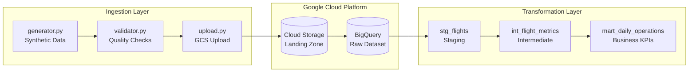

# Aero360 - Airline Data Pipeline

A production-ready **DataOps** pipeline for airline flight data analytics, built on **Google Cloud Platform**.

## Architecture



## Project Structure

```
Aero360/
├── terraform/           # Infrastructure as Code (IaC)
│   ├── main.tf          # GCS Bucket + BigQuery Dataset
│   ├── provider.tf      # Google Cloud provider config
│   ├── variables.tf     # Parameterized variables
│   └── backend.tf       # Remote state in GCS
│
├── ingestion/           # Data Ingestion Layer
│   └── src/
│       ├── generator.py # Synthetic flight data generator
│       ├── validator.py # JSON Schema validation
│       └── upload.py    # Upload to GCS
│
├── dbt_project/         # Data Transformation (dbt)
│   └── models/
│       ├── staging/     # Raw data cleaning
│       ├── intermediate/# Aggregated metrics
│       └── marts/       # Business-ready KPIs
│
└── .github/workflows/   # CI/CD Pipelines
    └── ci.yml           # Terraform + dbt + Python checks
```

## Quick Start

### Prerequisites
- [Terraform](https://terraform.io) >= 1.0
- [Python](https://python.org) >= 3.9
- [dbt-core](https://docs.getdbt.com) >= 1.5
- GCP Project with billing enabled

### 1. Infrastructure Setup
```bash
cd terraform
cp terraform.tfvars.example terraform.tfvars
# Edit terraform.tfvars with your project_id

terraform init
terraform plan
terraform apply
```

### 2. Ingestion Setup
```bash
cd ingestion
python -m venv venv
source venv/bin/activate  # Windows: venv\Scripts\activate
pip install -r requirements.txt

# Set environment variables
export GCS_BUCKET_NAME="your-project-id-vuelos-landing"
export GOOGLE_APPLICATION_CREDENTIALS="/path/to/service-account.json"

# Generate and upload test data
python src/generator.py
python src/validator.py
python src/upload.py
```

### 3. dbt Transformation
```bash
cd dbt_project
pip install dbt-bigquery

# Configure profiles.yml with your credentials
dbt deps
dbt run
dbt test
```

## Environment Variables

| Variable | Description | Required |
|----------|-------------|----------|
| `GCS_BUCKET_NAME` | Target GCS bucket for landing zone | Yes |
| `GOOGLE_APPLICATION_CREDENTIALS` | Path to GCP service account JSON | Yes |
| `GCP_PROJECT_ID` | Google Cloud Project ID | Yes |

## Data Quality

The pipeline includes multiple quality gates:

1. **Pre-ingestion** (`validator.py`):
   - JSON Schema validation
   - Field range checks (passengers: 1-500, fuel: 0-100)
   - Airport code format (3 uppercase letters)

2. **dbt Tests** (`schema.yml`):
   - Primary key uniqueness
   - Not null constraints
   - Referential integrity

## Key Metrics

| Metric | Description | Location |
|--------|-------------|----------|
| `total_flights` | Daily flight count | `mart_daily_operations` |
| `total_passengers` | Passengers transported | `mart_daily_operations` |
| `avg_fuel_efficiency` | Average fuel level | `mart_daily_operations` |
| `flights_per_route` | Flights by origin-destination | `int_flight_metrics` |

## Tech Stack

| Layer | Technology |
|-------|------------|
| Infrastructure | Terraform, GCS, BigQuery |
| Ingestion | Python, google-cloud-storage |
| Transformation | dbt-core, dbt-bigquery |
| CI/CD | GitHub Actions |
| Quality | jsonschema, dbt tests |

## License

MIT License - See [LICENSE](LICENSE) for details.
