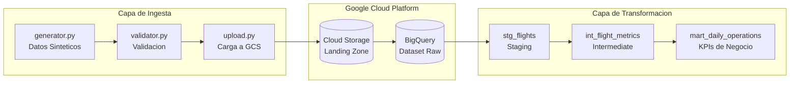

# Aero360 - Pipeline de Datos para Aerolinea

Pipeline de **DataOps** listo para produccion, construido sobre **Google Cloud Platform**.

## Arquitectura



## Estructura del Proyecto

```
Aero360/
├── terraform/           # Infraestructura como Codigo (IaC)
│   ├── main.tf          # Bucket GCS + Dataset BigQuery
│   ├── provider.tf      # Configuracion del provider GCP
│   ├── variables.tf     # Variables parametrizadas
│   └── backend.tf       # Estado remoto en GCS
│
├── ingestion/           # Capa de Ingesta de Datos
│   └── src/
│       ├── generator.py # Generador de datos sinteticos
│       ├── validator.py # Validacion con JSON Schema
│       └── upload.py    # Carga a GCS
│
├── dbt_project/         # Transformacion de Datos (dbt)
│   └── models/
│       ├── staging/     # Limpieza de datos raw
│       ├── intermediate/# Metricas agregadas
│       └── marts/       # KPIs listos para dashboards
│
└── .github/workflows/   # Pipelines de CI/CD
    └── ci.yml           # Validacion de Terraform + SQL + Python
```

## Inicio Rapido

### Prerequisitos
- [Terraform](https://terraform.io) >= 1.0
- [Python](https://python.org) >= 3.9
- [dbt-core](https://docs.getdbt.com) >= 1.5
- Proyecto de GCP con facturacion habilitada

### 1. Configurar Infraestructura
```bash
cd terraform
terraform init
terraform apply
```

### 2. Configurar Ingesta
```bash
cd ingestion
pip install -r requirements.txt

export GOOGLE_APPLICATION_CREDENTIALS="/ruta/a/service-account.json"

python src/generator.py      # Genera datos
python src/validator.py      # Valida
python src/batch_upload.py   # Sube 20 vuelos a GCS
```

### 3. Transformacion con dbt
```bash
cd dbt_project
pip install dbt-bigquery

dbt run --profiles-dir .
dbt test
dbt docs generate && dbt docs serve
```

## Modelos dbt - Arquitectura de Capas

El proyecto implementa una arquitectura **Medallion** con 3 capas:

```
┌─────────────────┐     ┌─────────────────┐     ┌─────────────────┐
│   stg_vuelos_raw│────▶│   stg_flights   │────▶│mart_daily_ops   │
│    (source)     │     │   (staging)     │     │    (mart)       │
│   Datos crudos  │     │  Datos limpios  │     │  KPIs diarios   │
└─────────────────┘     └─────────────────┘     └─────────────────┘
       JSON                   VIEW                   TABLE
```

### Capa Staging: `stg_flights`

Limpia y deduplica los datos crudos:

```sql
-- Convertir strings vacios a NULL
nullif(cast(flight_id as STRING), '') as flight_id

-- Deduplicar: mantener solo el registro mas reciente por flight_id
row_number() over (partition by flight_id order by event_at desc) as rn
```

**Transformaciones aplicadas:**
- Tipado correcto de columnas (STRING, INT64, TIMESTAMP)
- Manejo de valores nulos con `NULLIF`
- Deduplicacion con `ROW_NUMBER()` particionado

### Capa Intermediate: `int_flight_metrics`

Agrega metricas por ruta (origen-destino):

```sql
select
    concat(origin_airport, ' -> ', destination_airport) as ruta,
    count(*) as total_vuelos,
    avg(passenger_count) as promedio_pasajeros
from {{ ref('stg_flights') }}
group by origin_airport, destination_airport
```

**Materializacion:** `ephemeral` (no persiste, se usa como CTE)

### Capa Marts: `mart_daily_operations`

KPIs diarios listos para dashboards:

```sql
select
    date(event_at) as fecha,
    count(*) as total_vuelos,
    sum(passenger_count) as total_pasajeros,
    avg(fuel_percentage) as eficiencia_combustible
from {{ ref('stg_flights') }}
group by date(event_at)
```

**Materializacion:** `table` (optimizado para queries frecuentes)

### Lineage de dbt

El grafico de dependencias muestra el flujo de datos:

```
Source (GCS)  -->  Staging  -->  Mart
  (verde)          (azul)       (rosa)
```

Para ver el grafico interactivo:
```bash
dbt docs generate
dbt docs serve --port 8080
```

## Variables de Entorno

| Variable | Descripcion |
|----------|-------------|
| `GCS_BUCKET_NAME` | Bucket de GCS para landing zone |
| `GOOGLE_APPLICATION_CREDENTIALS` | Ruta al JSON de service account |

## Calidad de Datos

### Pre-ingesta (Python)

| Validacion | Descripcion |
|------------|-------------|
| Esquema JSON | Estructura y tipos correctos |
| Formato flight_id | 2 letras + 3-4 digitos |
| Rango pasajeros | Entre 1 y 500 |
| Rango combustible | Entre 0 y 100 |
| Origen != Destino | Regla de negocio |

### Post-carga (dbt tests)

```yaml
models:
  - name: stg_flights
    columns:
      - name: flight_id
        tests:
          - unique
          - not_null
```

## Metricas Disponibles

| Metrica | Descripcion | Modelo |
|---------|-------------|--------|
| `total_vuelos` | Vuelos por dia | `mart_daily_operations` |
| `total_pasajeros` | Pasajeros transportados | `mart_daily_operations` |
| `eficiencia_combustible` | Nivel promedio | `mart_daily_operations` |
| `vuelos_por_ruta` | Vuelos por origen-destino | `int_flight_metrics` |

## Stack Tecnologico

| Capa | Tecnologia |
|------|------------|
| Infraestructura | Terraform, GCS, BigQuery |
| Ingesta | Python, google-cloud-storage |
| Validacion | jsonschema |
| Transformacion | dbt-core, dbt-bigquery |
| CI/CD | GitHub Actions, SQLFluff |

## Licencia

MIT License
