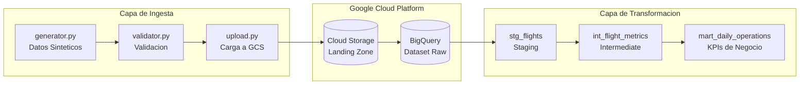

# Aero360 - Pipeline de Datos para Aerolinea

Pipeline de **DataOps** listo para produccion, construido sobre **Google Cloud Platform**.

## Arquitectura



## Estructura del Proyecto

```
Aero360/
├── terraform/           # Infraestructura como Codigo (IaC)
│   ├── main.tf          # Bucket GCS + Dataset BigQuery
│   ├── provider.tf      # Configuracion del provider GCP
│   ├── variables.tf     # Variables parametrizadas
│   └── backend.tf       # Estado remoto en GCS
│
├── ingestion/           # Capa de Ingesta de Datos
│   └── src/
│       ├── generator.py # Generador de datos sinteticos
│       ├── validator.py # Validacion con JSON Schema
│       └── upload.py    # Carga a GCS
│
├── dbt_project/         # Transformacion de Datos (dbt)
│   └── models/
│       ├── staging/     # Limpieza de datos raw
│       ├── intermediate/# Metricas agregadas
│       └── marts/       # KPIs listos para dashboards
│
└── .github/workflows/   # Pipelines de CI/CD
    └── ci.yml           # Validacion de Terraform + dbt + Python
```

## Inicio Rapido

### Prerequisitos
- [Terraform](https://terraform.io) >= 1.0
- [Python](https://python.org) >= 3.9
- [dbt-core](https://docs.getdbt.com) >= 1.5
- Proyecto de GCP con facturacion habilitada

### 1. Configurar Infraestructura
```bash
cd terraform
cp terraform.tfvars.example terraform.tfvars
# Editar terraform.tfvars con tu project_id

terraform init
terraform plan
terraform apply
```

### 2. Configurar Ingesta
```bash
cd ingestion
python -m venv venv
source venv/bin/activate  # Windows: venv\Scripts\activate
pip install -r requirements.txt

# Configurar variables de entorno
export GCS_BUCKET_NAME="tu-project-id-vuelos-landing"
export GOOGLE_APPLICATION_CREDENTIALS="/ruta/a/service-account.json"

# Generar y subir datos de prueba
python src/generator.py
python src/validator.py
python src/upload.py
```

### 3. Transformacion con dbt
```bash
cd dbt_project
pip install dbt-bigquery

# Configurar profiles.yml con tus credenciales
dbt deps
dbt run
dbt test
```

## Variables de Entorno

| Variable | Descripcion | Requerida |
|----------|-------------|-----------|
| `GCS_BUCKET_NAME` | Bucket de GCS para landing zone | Si |
| `GOOGLE_APPLICATION_CREDENTIALS` | Ruta al JSON de service account | Si |
| `GCP_PROJECT_ID` | ID del proyecto de Google Cloud | Si |

## Calidad de Datos

El pipeline incluye multiples puntos de validacion:

1. **Pre-ingesta** (`validator.py`):
   - Validacion de esquema JSON
   - Verificacion de rangos (pasajeros: 1-500, combustible: 0-100)
   - Formato de codigos de aeropuerto (3 letras mayusculas)

2. **Tests de dbt** (`schema.yml`):
   - Unicidad de clave primaria
   - Restricciones de not null
   - Integridad referencial

## Metricas Clave

| Metrica | Descripcion | Ubicacion |
|---------|-------------|-----------|
| `total_vuelos` | Cantidad de vuelos diarios | `mart_daily_operations` |
| `total_pasajeros` | Pasajeros transportados | `mart_daily_operations` |
| `eficiencia_combustible` | Nivel promedio de combustible | `mart_daily_operations` |
| `vuelos_por_ruta` | Vuelos por origen-destino | `int_flight_metrics` |

## Stack Tecnologico

| Capa | Tecnologia |
|------|------------|
| Infraestructura | Terraform, GCS, BigQuery |
| Ingesta | Python, google-cloud-storage |
| Transformacion | dbt-core, dbt-bigquery |
| CI/CD | GitHub Actions |
| Calidad | jsonschema, dbt tests |

## Licencia

MIT License
